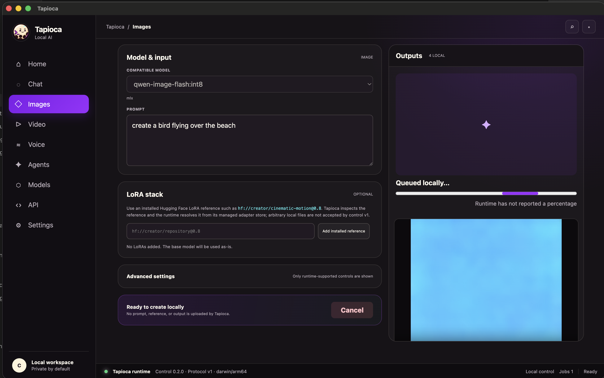

<p align="center">
  
</p>

<h1 align="center">Tapioca</h1>

<p align="center"><strong>Your local models, ready to roll.</strong></p>

Tapioca is a local AI runtime and desktop studio for language, speech, image,
and video models. It downloads supported models on demand, chooses a native
backend for the computer, and can expose local models to coding agents.

Use the friendly desktop app or the full CLI—both run the same private,
local-first engine.

## Tapioca Desktop

Tapioca Desktop brings the complete local workflow into one interface:

- Chat with installed models and see model reasoning as it streams.
- Generate and manage images, videos, speech, and cloned voices.
- Record voice-cloning references with a live microphone level meter.
- Choose guided image resolutions, video duration, orientation, quality, and
  workload presets while retaining exact expert controls.
- Pull LoRAs from Hugging Face, Civitai, or ModelScope, import local
  `.safetensors` files, and assign them with model-family compatibility guidance.
- Pull models, inspect hardware requirements, and track local storage.
- Launch Codex, Claude Code, OpenCode, OpenClaw, and Hermes with a local model.
- Navigate with a consistent accessible icon system and review long agent paths
  without layout overflow.
- Monitor active jobs and keep generated media in a local gallery.

Download the latest installer from
[GitHub Releases](https://github.com/kyndlo/tapioca/releases/latest):

| Platform | Desktop package | CLI package |
| --- | --- | --- |
| macOS Apple Silicon | `.dmg` | `tapioca-darwin-arm64.tar.gz` |
| Windows x64 | `.exe` | `tapioca-windows-amd64.zip` |
| Windows ARM64 | `.exe` | `tapioca-windows-arm64.zip` |
| Linux x64 | `.AppImage` | `tapioca-linux-amd64.tar.gz` |
| Linux ARM64 | `.AppImage` | `tapioca-linux-arm64.tar.gz` |



## Start here

1. [Download the desktop app](https://github.com/kyndlo/tapioca/releases/latest)
   or follow the [complete beginner guide](https://tapioca.rootfruit.cc/learn)
2. [Run your first local model](docs/getting-started/quickstart.md)
3. [Choose a model for your computer](docs/guides/choosing-models.md)
4. Explore the task-specific guides below.

```bash
tapioca catalog
tapioca catalog update
tapioca update [--check]
tapioca run gemma3:12b-mlx
```

Tapioca pulls a catalog model automatically when it is first used. Enter
`/bye` or press Ctrl-D to leave an interactive chat and stop its server.

## Documentation

### Getting started

- [Installation](docs/getting-started/installation.md)
- [Beginner learning center](https://tapioca.rootfruit.cc/learn)
- [Quickstart](docs/getting-started/quickstart.md)
- [Choosing models and understanding memory](docs/guides/choosing-models.md)

### Use Tapioca

- [Text chat and local APIs](docs/guides/text-models.md)
- [LLM and agent operating guide](docs/agents/agent-guide.md)
- [Agent API reference](docs/agents/api-reference.md)
- [Install the Codex plugin or Claude Code skill](docs/agents/install-integrations.md)
- [Coding agents: Codex, Claude Code, OpenCode, OpenClaw, and Hermes](docs/guides/coding-agents.md)
- [Image generation](docs/guides/image-generation.md)
- [Video generation](docs/guides/video-generation.md)
- [Text to speech and voice cloning](docs/guides/speech-and-voices.md)
- [LoRA adapters and model composition](docs/concepts/lora-adapters.md)
- [Replaceable video engines](docs/concepts/video-engines.md)

### Reference and help

- [Command reference](docs/reference/commands.md)
- [Files, models, and disk storage](docs/reference/storage.md)
- [Import existing LoRAs and transfer model files](docs/guides/import-and-transfer.md)
- [Troubleshooting](docs/reference/troubleshooting.md)
- [Build from source](docs/reference/building.md)

Agents can start at [tapioca.rootfruit.cc/llm](https://tapioca.rootfruit.cc/llm)
or read the machine-oriented
[llms-full.txt](https://tapioca.rootfruit.cc/llms-full.txt).

## Platform summary

| Capability | macOS Apple Silicon | Windows x64 | Windows ARM64 | Linux x64 | Linux ARM64 |
| --- | --- | --- | --- | --- | --- |
| GGUF text models | Metal llama.cpp | Vulkan llama.cpp | CPU llama.cpp | Vulkan llama.cpp | Vulkan llama.cpp |
| Native MLX text | Yes | No | No | No | No |
| Speech and voice cloning | MLX or MPS/CPU | CUDA or CPU | CPU | CUDA or CPU | CPU |
| Image generation | MLX/MFLUX | CUDA or ONNX DirectML | ONNX Runtime CPU | NVIDIA CUDA | Not yet |
| Video generation | MLX | NVIDIA CUDA/Diffusers | Not yet | NVIDIA CUDA/Diffusers | Not yet |
| Coding-agent APIs | Yes | Yes | Yes | Yes | Yes |
| Desktop app | Yes | Yes | Yes | Yes | Yes |

Run `tapioca catalog` for the exact models, download sizes, memory guidance,
GPU requirements, and supported platforms in the installed release.
Run `tapioca catalog update` to fetch the checksummed catalog independently of
the binary, or use **Refresh catalog** in Desktop settings. The compiled
catalog remains an offline fallback. `tapioca update` verifies the latest
GitHub Release checksum and replaces the CLI/runtime without touching models,
adapters, voices, or outputs.

MiniMax-H3 is available for Apple Silicon and Windows/Linux NVIDIA as
`minimax-h3`. It supports text-to-video, image-to-video, and native stereo
audio through a managed ComfyUI runtime. The four-file model bundle is about
41 GiB; Apple Silicon needs at least 48 GiB unified memory, while the CUDA
variant is designed for 16 GiB GPUs such as the RTX 4070 Ti SUPER. Compatible
MiniMax-H3 transformer LoRAs can be stacked with repeated `--adapter` flags.
On Windows x64, MiniMax-H3 automatically provisions its pinned Python and
CUDA-enabled media runtime; users need a current NVIDIA driver, not Git, a
system Python installation, or the CUDA Toolkit.

Krea 2 Turbo is available as `krea-2-turbo` for Windows/Linux NVIDIA and,
experimentally, Apple Silicon Macs with large unified memory. The curated
Diffusers snapshot is about 34 GiB and defaults to 8 steps at 1024×1024. It is
a gated model: users must accept its Hugging Face terms, set `HF_TOKEN`, review
the Krea 2 Community License, and run
`tapioca pull krea-2-turbo --accept-license`. Tapioca does not accept provider
terms or store access tokens on a user's behalf. `--accept-license` records the
local Tapioca acknowledgement; it does not approve access in the user's
Hugging Face account.

## Everyday commands

```text
tapioca catalog
tapioca catalog update
tapioca update [--check]
tapioca list
tapioca pull MODEL[:VARIANT] [--accept-license]
tapioca run MODEL [--context TOKENS]
tapioca serve MODEL [--port 11435] [--context TOKENS]
tapioca image MODEL --prompt TEXT [--seed NUMBER | --random-seed] [--output image.png]
tapioca edit MODEL --image FILE [--image FILE] --prompt TEXT [--seed NUMBER | --random-seed]
tapioca video MODEL --prompt TEXT [--image start.png] [--seconds N | --frames N] [--seed NUMBER | --random-seed] [--output video.mp4]
tapioca tts MODEL --text TEXT [--voice NAME] [--output speech.wav]
tapioca voice (create|list|inspect|remove) [NAME]
tapioca adapter (inspect|pull|import|list) [REFERENCE]
tapioca create NAME --base MODEL [--adapter REFERENCE]
tapioca launch CLIENT MODEL [-- CLIENT_ARGS...]
```

See the [command reference](docs/reference/commands.md) for flags and examples.

### Choose video length and reusable seeds

Use `--seconds` when you know the approximate clip length but not the valid
frame count for a model. Tapioca selects and prints the nearest supported frame
count. Do not combine `--seconds` with `--frames`:

```bash
tapioca video minimax-h3 \
  --prompt 'A presenter says exactly: "Hello from Tapioca."' \
  --seconds 5 --random-seed --output hello.mp4
```

Image, edit, and video commands use seed `0` by default. `--random-seed`
generates and prints a portable random seed. Copy that value into
`--seed NUMBER` to reproduce the same generation settings later. The two seed
flags cannot be combined.

## Current scope

The built-in catalog provides tested defaults, while image and video commands
can also accept direct `hf://OWNER/REPOSITORY` base-model references. LoRA
support is backend-specific: MFLUX image models, CUDA Diffusers pipelines,
Wan models through MLX-video, and MiniMax-H3 through Tapioca's managed video
engine can load compatible adapters. Tapioca validates
obvious model-family mismatches, but the upstream runtime remains the final
authority for less common adapters. Windows x64 AMD/Intel GPUs use ONNX
DirectML; Windows ARM64 uses native ONNX Runtime CPU inference.
